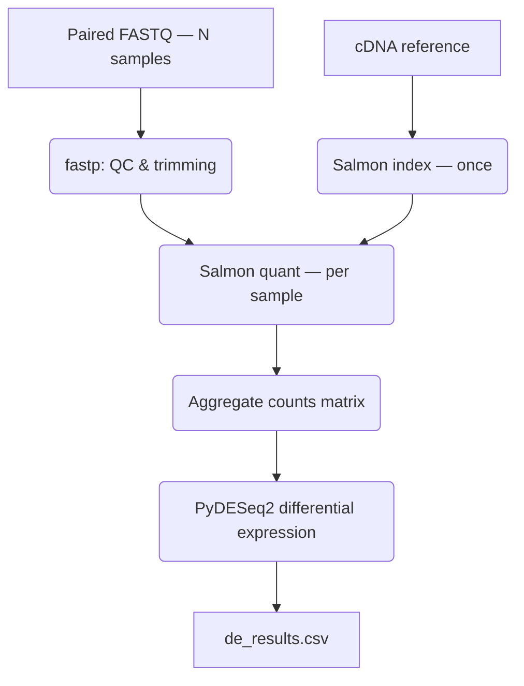

# RNA-seq Differential Expression (Salmon + WDL)

Bulk RNA-seq quantification and differential expression pipeline using Salmon pseudo-alignment, orchestrated in WDL.



## What This Pipeline Does

1. Quality control and adapter/quality trimming (fastp)
2. Build a Salmon index from a transcriptome (cDNA, not genome) reference — once per project
3. Pseudo-align and quantify each sample against the index (Salmon quant)
4. Aggregate per-sample `quant.sf` files into a single counts matrix
5. Differential expression analysis with PyDESeq2 (Python port of DESeq2)

## Why WDL, why Salmon

This pipeline intentionally uses a different orchestration language than [plant-variant-calling](https://github.com/Alphative/plant-variant-calling) (Nextflow) — WDL is the language GATK Best Practices workflows are published in, and demonstrates the same pipeline-engineering skillset across a different paradigm (explicit `task`/`workflow`/`scatter` semantics vs. Nextflow's channel-based implicit parallelism).

Salmon was chosen over STAR for the alignment step: it's a pseudo-aligner (no full genome alignment, transcript-level quantification only), meaning lower compute/memory requirements — a deliberate cost-conscious choice, consistent with the Spot-instance-first approach in the Terraform setup for the GATK pipeline.

## Requirements

- Docker
- [miniwdl](https://github.com/chanzuckerberg/miniwdl) (`pip install miniwdl`)
- Python 3 + pytest, for running the test suite

## Installation

```bash
git clone https://github.com/Alphative/rnaseq-salmon-wdl
cd rnaseq-salmon-wdl
```

Build the three Docker images (one per tool group — fastp, salmon, and the Python/PyDESeq2 analysis stage each have different dependencies):

```bash
docker build -t rnaseq-salmon-wdl:qc -f docker/Dockerfile.qc .
docker build -t rnaseq-salmon-wdl:salmon -f docker/Dockerfile.salmon .
docker build -t rnaseq-salmon-wdl:analysis -f docker/Dockerfile.analysis .
```

## Input Data

### Sample sheet (`samples.tsv`)

Tab-separated, one row per sample. `read_objects()` in WDL requires TSV specifically (not CSV):

```
sample_id	fastq_1	fastq_2
control_1	data/sample1_1.fastq.gz	data/sample1_2.fastq.gz
control_2	data/sample2_1.fastq.gz	data/sample2_2.fastq.gz
```

### Condition sheet (`condition_sheet.csv`)

Used by PyDESeq2 to define comparison groups:

```csv
sample_id,condition
control_1,control
control_2,control
treatment_1,treatment
treatment_2,treatment
```

### cDNA reference

Salmon needs a **transcriptome** FASTA (cDNA), not a genome FASTA — e.g. from [Ensembl](https://ftp.ensembl.org/pub/) (`*.cdna.all.fa.gz`).

## Running

Create an `inputs.json`:

```json
{
  "rnaseq_pipeline.cdna_reference": "data/your_reference.cdna.all.fa.gz",
  "rnaseq_pipeline.samples_tsv": "data/samples.tsv",
  "rnaseq_pipeline.condition_sheet": "data/condition_sheet.csv"
}
```

Run:

```bash
miniwdl run main.wdl -i inputs.json --cfg miniwdl.cfg
```

`miniwdl.cfg` sets `allow_any_input = true` — required because `samples.tsv` contains file paths that aren't explicitly declared as top-level workflow inputs (they're read indirectly via `read_objects()`), which miniwdl's default sandbox blocks.

## Validated on Real Data

The full pipeline was run end-to-end on a real, published paired-end RNA-seq dataset (Hakkaart et al. 2020, *Biotechnol Bioeng*, [PRJNA550078](https://www.ncbi.nlm.nih.gov/bioproject/PRJNA550078)) — *Saccharomyces cerevisiae* grown under standard (pH 5, 0.04% CO₂) vs. high-CO₂ stress (pH 5, 50% CO₂) conditions, 3 biological replicates per group.

Results: several genes reached high-confidence statistical significance (e.g. `padj` as low as ~1.6×10⁻⁵¹), with `log2FoldChange` in a biologically plausible range — confirming the full chain (fastp → Salmon → aggregation → PyDESeq2) produces a statistically coherent result on real data, not just mechanically-valid output.

Mitochondrial transcripts (`Q00xx_mRNA` naming) show `NA` statistics — expected behavior from DESeq2's independent filtering on genes with near-zero counts (poly-A selection under-captures mitochondrial transcripts), not a pipeline defect.

## Known Design Decisions

- **WDL 1.0**, not 1.1/1.2 — broadest compatibility across runners (miniwdl, Cromwell) and the version most published GATK/Broad WDL workflows use. Trade-off: `dirname()` isn't available in 1.0, worked around by staging `Array[File]` index files into a fixed-name directory via `cp` (not `mv` — `mv` fails on bind-mounted files with "Device or resource busy").
- **Salmon's `NumReads`** are fractional (EM-based multi-mapping resolution) — rounded to integers before DESeq2, which requires integer counts by design.
- **Explicit `contrast`** required in `DeseqStats` — determines the sign of `log2FoldChange`; without it, direction of comparison is ambiguous.

## Testing

```bash
pytest tests/ -v
```

Tests cover the pipeline's own data-reshaping logic (counts-matrix merging, DESeq2 input transposition/rounding) — not PyDESeq2's statistical internals, which are an already-validated third-party library.

## Project Structure

```
rnaseq-salmon-wdl/
├── main.wdl                          # Workflow: wires tasks together with scatter
├── miniwdl.cfg                       # Runner config (allow_any_input)
├── inputs.json                       # Example inputs
├── tasks/
│   ├── fastp.wdl
│   ├── salmon_index.wdl
│   ├── salmon_quant.wdl
│   ├── aggregate_counts.wdl
│   └── differential_expression.wdl
├── source/
│   ├── aggregate_counts.py
│   └── differential_expression.py
├── docker/
│   ├── Dockerfile.qc                 # fastp
│   ├── Dockerfile.salmon             # salmon
│   └── Dockerfile.analysis           # python, pandas, pydeseq2
├── tests/
│   ├── conftest.py
│   ├── test_aggregate_counts.py
│   └── test_differential_expression.py
└── data/                             # input data (not tracked)
    ├── samples.tsv
    ├── condition_sheet.csv
    └── reference.cdna.all.fa.gz
```